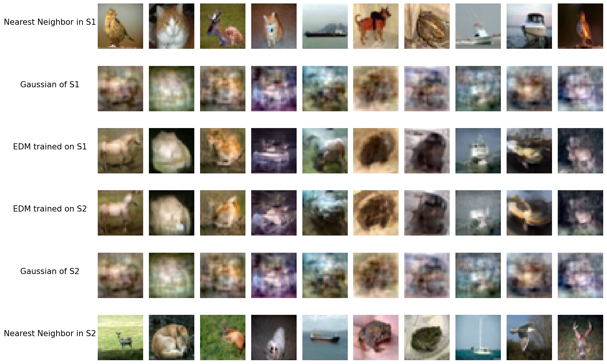

## Understanding Generalizability of Diffusion Models Requires Rethinking the Hidden Gaussian Structure<br><sub>Official PyTorch implementation of the NeurIPS 2024 paper</sub>

**Understanding Generalizability of Diffusion Models Requires Rethinking the Hidden Gaussian Structure**<br>

Xiang Li, Yixiang Dai, Qing Qu
<br>[https://arxiv.org/abs/2206.00364](https://arxiv.org/pdf/2410.24060)<br>

Abstract: *In this work, we study the generalizability of diffusion models by looking into
the hidden properties of the learned score functions, which are essentially a series
of deep denoisers trained on various noise levels. We observe that as diffusion
models transition from memorization to generalization, their corresponding nonlinear diffusion denoisers exhibit increasing linearity. This discovery leads us to
investigate the linear counterparts of the nonlinear diffusion models, which are a
series of linear models trained to match the function mappings of the nonlinear
diffusion denoisers. Interestingly, these linear denoisers are nearly optimal for
multivariate Gaussian distributions defined by the empirical mean and covariance
of the training dataset, and they effectively approximate the behavior of nonlinear
diffusion models. This finding implies that diffusion models have the inductive bias
towards capturing and utilizing the Gaussian structure (covariance information)
of the training dataset for data generation. We empirically demonstrate that this
inductive bias is a unique property of diffusion models in the generalization regime,
which becomes increasingly evident when the model’s capacity is relatively small
compared to the training dataset size. In the case where the model is highly overparameterized, this inductive bias emerges during the initial training phases before the
model fully memorizes its training data. Our study provides crucial insights into
understanding the notable strong generalization phenomenon recently observed in
real-world diffusion models.*

## 1. Getting started

### 1) Clone the repository

```
git clone https://github.com/Morefre/Understanding-Generalizability-of-Diffusion-Models-Requires-Rethinking-the-Hidden-Gaussian-Structure.git

cd Understanding-Generalizability-of-Diffusion-Models-Requires-Rethinking-the-Hidden-Gaussian-Structure
```


### 2) Set environment

```
  - conda env create -f environment.yml -n edm
  - conda activate edm
```

## 2. The Emergence of Gaussian Structures in Diffusion Models

We first demonstrate that diffusion models in the generalization regime have the inductive bias towards learning diffusion denoisers that are close to the optimal denoiers of a Multivariate Gaussian distribution characterized by the empirical mean and covariance of the training dataset.

### 1) Prepare datasets
We first prepare the following datasets:

**CIFAR-10:** Download the [CIFAR-10 python version](https://www.cs.toronto.edu/~kriz/cifar.html) and convert the training (50000 images) and test set to ZIP archives respectively:

```.bash
python dataset_tool.py --source=downloads/cifar10/cifar-10-train-python.tar.gz \
    --dest=datasets/cifar10-32x32.zip

python dataset_tool.py --source=downloads/cifar10/cifar-10-test-python.tar.gz \
    --dest=datasets/cifar10-32x32-test.zip
```

**FFHQ:** Download the [Flickr-Faces-HQ dataset](https://github.com/NVlabs/ffhq-dataset) as 1024x1024 images and convert to ZIP archive at 64x64 resolution:

```.bash
python dataset_tool.py --source=downloads/ffhq/images1024x1024 \
    --dest=datasets/ffhq-64x64.zip --resolution=64x64
```

**CelebA-HQ:** Download the [CelebA-HQ](https://www.kaggle.com/datasets/badasstechie/celebahq-resized-256x256) and convert to ZIP archive at 64x64 resolution:

```.bash
python dataset_tool.py --source=downloads/celeb_hq/images256x256 \
    --dest=datasets/celeb_hq_64x64.zip --resolution=64x64
```


### 2) Diffusion models and Gaussian models generate similar images 
In the notebook [Gaussian_model_vs_EDM_model_FFHQ_and_Cifar.ipynb](Gaussian_model_vs_EDM_model_FFHQ_and_Cifar.ipynb) we demonstrate that the nonlinear diffusion models in the generalization regime generate similar images as those generated by the linear Gaussian models.

### 3) Diffusion models learn similar denoisers as the Gaussian denoisers
In the [Gaussian_Denoisers_vs_EDM_Denoisers.ipynb](Gaussian_Denoisers_vs_EDM_Denoisers.ipynb) we demonstrate that the diffusion denoisers in the generalization regime generate similar denoising outputs as those of the linear Gaussian denoisers for a wide range of noise levels.

## 3. Conditions for the Emergence of Gaussian Structures

Next, we investigate the conditions under which the Gaussian inductive bias manifests. Our experiments in [Conditions_for_the_Emergence_of_Gaussian_Structure.ipynb](Conditions_for_the_Emergence_of_Gaussian_Structure.ipynb) imply that

#### 1) For a diffusion model with fixed model capacity, increasing the training dataset size prompts the emergence of Gaussian structure.

#### 2) For a fixed dataset, decreasing the model capacity prompts the emergence of Gaussian structure.

#### 3) In the overparameterized regime, where model capacity exceeds training dataset size, diffusion models eventually memorize the training data after sufficient training. However, there exists a initial training phase in which diffusion models learn the Gaussian structure.

To run this notebook, you need to download the network weights (Varying_dataset_size, Varying_model_scale and Varying_training_epochs) from [link_to_weights](https://drive.google.com/drive/folders/122R-8zUNkUlPx3XaaLp6j37_4TNZsxjn?usp=drive_link).


## 4. Connections between Strong Generalization and the Gaussian structure 

In [Strong_Generalization.ipynb](Strong_Generalization.ipynb), we study the 'Strong Generalization' phenomenon of diffusion models, that is, diffusion models trained on non-overlapping datasets generate nearly identical images. This phenomenon is previously observed for diffusion models trained on sufficiently large dataset. Our study demonstrates that 

#### (i) When strong generalization happens, the generated images of diffusion models share structural similarity with those generated from the Gaussian models, which implies the Gaussian structure plays an important role in the generalizability of diffusion models.

#### (ii) Decrasing model scale and early stopping the training process can prompt strong generalization, though in this case the generated images have lower quality.

To run this notebook, you need to download the subsets (datasets folder) and the corresponding network weights (Strong_Generalization_Weights) from [link_to_weights](https://drive.google.com/drive/folders/122R-8zUNkUlPx3XaaLp6j37_4TNZsxjn?usp=drive_link).


## 5. The emerging linearity of diffusion models from memorization to generalization

Lastly, in [Emerging Linearity of diffusion models.ipynb
](Emerging_Linearity_of_diffusion_models.ipynb) we demonstrate that

#### (i) As diffusion models transition from memorization to generalization, the corresponding diffusion denoisers become increasingly linear (though the diffusion denoisers exhibit significant nonlinarity in the intermediate-noise regime).

### (ii) The best linear estimations of the nonlinear diffusion denoisers are approximately equivalent to the optimal denoisers of the Gaussian distribution characterized by the empirical mean and covariance of the training dataset. 

We note that the second phenomenon is not trivial. Though Theorem 1 in the paper implies that if we directly train linear diffusion models using the denosing score matching loss, we will get the Gaussian denoiser, here we are instead using linear models to approximate trained nonlinear diffusion models. In general, suppose we have the ground truth score function of a non-Gaussian distribution and then use a linear (affine) model to approximate it, the corresponding optimal linear model won't be the same as the optimal denoiser for the Gaussian distribution characterized by the mean and covariance of the non-Gaussian distribution.

## 6. References
  * Our implementation is based on [EDM](https://github.com/NVlabs/edm).
  * The implementation of the optimal denoiser for the discrete empirical distribution is adapted from [DiffMemorize](https://github.com/sail-sg/DiffMemorize).

## 7. Citation
If you find our work interesting, please consider citing
```
@inproceedings{liunderstanding,
  title={Understanding Generalizability of Diffusion Models Requires Rethinking the Hidden Gaussian Structure},
  author={Li, Xiang and Dai, Yixiang and Qu, Qing},
  booktitle={The Thirty-eighth Annual Conference on Neural Information Processing Systems}
}
```
 
## 8. Contact

- Xiang Li, forkobe@umich.edu
